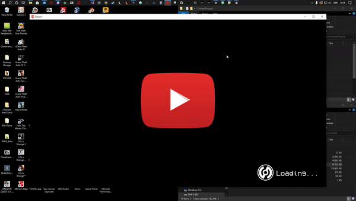

# UnrealModUnlocker-Public 1.0.4

## General Information:  
UnrealModUnlocker Public and UnrealModUnlocker Basic are NOT from the same codebase.  
UnrealModUnlocker Public ONLY contains code for the loose file loading part of the UMU Project.  
Since UnrealModUnlocker Public now supports ALL version of Unreal Engine 4 (compiled with the standard compiler settings in visual studio),  
it is now considered FINAL and version 1.0  

Unlocks loading of Third Party Unreal Engine 4 loose files for 90-95% of UE4 games.  
This software is for unlocking loading of loose file packages (.uasset | .ubulk | .uexp | .umap and any other file you could normally find inside the PAK archives).  

## How to make mods (The Basics of Unreal Engine 4 Modding Tutorial Series):  
Click on the GIF to start watching the playlist!  

## How to use:
**Step 1:** Build the source for 64-Bit Release / or download the binary from the "[Actions](https://github.com/IllusorySoftware/UnrealModUnlocker-Public/actions) -> Latest Worflow Run -> Summary" page.

**Step 2:** Rename output DLL to dxgi.dll

**Step 3:** Put dxgi.dll in "/Game/ProjectName/Binaries/Win64/"

**Step 4:** Run Game with mods applied

**Step 5:** Profit!

## 1.0.4 Changes:

**-GENERAL CODE CLEAN UP**  
-Made lots of reusable classes for hooks, sigscanning and other things.  
-Rewrote parts of dllmain.  
-Rewrote the SigScanner to use profiles.  
-Made the SigScanner profiles easier to understand.  
-Wrote a bunch of comments.  

## Compatibility:

Engine  | Version | Supported Architecture |  Compatibility
------------- | ------------- | ------------- | -------------
Unreal Engine | 4.0  | x64  | Supported
Unreal Engine | 4.1  | x64  | Supported
Unreal Engine | 4.2  | x64  | Supported
Unreal Engine | 4.3  | x64  | Supported
Unreal Engine | 4.4  | x64  | Supported
Unreal Engine | 4.5  | x64  | Supported
Unreal Engine | 4.6  | x64  | Supported
Unreal Engine | 4.7  | x64  | Supported
Unreal Engine | 4.8  | x64  | Supported
Unreal Engine | 4.9  | x64  | Supported
Unreal Engine | 4.10  | x64  | Supported
Unreal Engine | 4.11  | x64  | Supported
Unreal Engine | 4.12  | x64  | Supported
Unreal Engine | 4.13  | x64  | Supported
Unreal Engine | 4.14  | x64  | Supported
Unreal Engine | 4.15  | x64  | Supported
Unreal Engine | 4.16  | x64  | Supported
Unreal Engine | 4.17  | x64  | Supported
Unreal Engine | 4.18  | x64  | Supported
Unreal Engine | 4.19  | x64  | Supported
Unreal Engine | 4.20  | x64  | Supported
Unreal Engine | 4.21  | x64  | Supported
Unreal Engine | 4.22  | x64  | Supported
Unreal Engine | 4.23  | x64  | Supported
Unreal Engine | 4.24  | x64  | Supported
Unreal Engine | 4.25  | x64  | Supported
Unreal Engine | 4.26  | x64  | Supported
Unreal Engine | 4.27  | x64  | Supported

## How to add support for YOUR game:
Tutorial to help you add support for your game: https://www.youtube.com/watch?v=Uf3cArpU6Xk

### Credits:
Special Thanks to emoose for DQXIHook and dga711 for ezpz, which made this possible.

## /GHFear and Genesis @ IllusorySoftware
